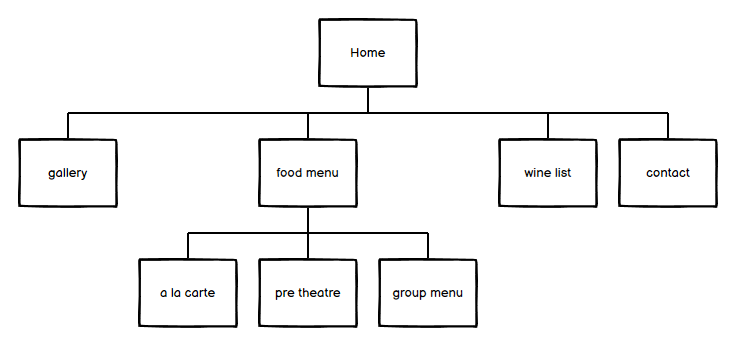

---
## Da Pino Restaurant
#### ... It's a matter of taste...
---

The goal of the (fictitious) Da Pino Restaurant Website is to provide up to date information about the Restaurant Menu, Special Deals available, Wine List, Take Away Deals, Social Media Links, and Reviews from customers. Also provide contact details, address, and location on map, pictures of the Restaurant and of sample dishes available on the menu. The website advertises Sunday deals, Pre Theatre and Take Away promotions.

---  

---
> - ###   Content
>> - [Structure](#structure)
>> - [Purpose of the website](#purpose-of-the-website)
>> - [User Stories and Trade Offs](#user-stories-and-trade-offs)
>>> - [Features to implement in first version](#features-to-implement-in-first-version)
>>> - [Features to implement in future versions](#features-to-implement-in-future-versions)
>> - [Wireframes](#wireframes)
>> - [Features Details](#features-details)
>>> - [Homepage](#homepage)
>>> - [Food Menu](#food-menu-features)
>>> - [Wine List](#wine-list-features)
>>> - [Gallery](#gallery-features)
>>> - [Contact](#contact-features)
>> - [Technologies Used](#technologies-used)
>>> - [Languages](#languages)
>>> - [Libraries](#libraries)
>>> - [Tools](#tools)
>> - [Testing](#testing)
>> - [Bugs](#bugs)
>> - [Credits](#credits)
>>> - [Media Images](#media-images)
>>> - [Favicon](#favicon)
>> - [Deployment](#deployment)
>> - [Acknowledgements](#acknowledgements)

## Structure

The Website is composed of a [Home page](index.html) a [Gallery](gallery.html) and three menu pages with the same structure [A la Carte](a-la-carte.html) [Pre Theatre](pre-theatre.html) and [Group Menu](group-menu.html) available for large groups. Also the [Wine List](wine-list.html) have the same structure. The [contact page](contract.html) display the email contact form for enquiries. All the pages links are present on the navigation bar, with the three food menu present in a dropdown menu.

---
 

---

The Website has a non-linear hyperlinked structure. A navigation bar in the header provides links to the different Menu Pages, the Wine List, The Gallery Page, and the Contact Form.  
In the mobile devices the navigation bar is collapsed into a toggle menu taking less real estate space and allows the home page to be a bit lighter and not too busy.  
Each page has the same header and footer making the website more intuitive and user friendly.    
The homepage main specials section have a full image on the background with three messages opening on the side: Special Sunday Offers, Pre Theatre and Take Away deals.  
In the Mobile devices the messages take the full width of the screen keeping the picture in the background. In desktop screens at the bottom of the main picture three columns contain reviews of different customers. In the tablet screen only 2 reviews are displayed inline. In the mobile view the three reviews are in a single column taking the full width of the screen.  
In the Gallery Page for mobile and tablet devices the pictures flow in the same screen one below the other. In the desktop view the images are displayed in collage with zoom property on the picture when hover. 
All the menu pages have the same body structure and colours, changing only the content, providing consistence and repetition thorough the website. A download button is present just below the menu title, giving the user the choice for download a printable copy of the menu.

## Purpose of the website 

The Restaurant Owner goal is to improve business, show potential customers menus and wines available with related prices, pictures of the Restaurant and the dishes, enhance take away and early evening trade. The owner need a website where users can access contact details, phone number, clear address with map location and a contact form for email enquiries. Let the users know that special deals are available for Groups, Christmas Parties, Business Dinners, and Private Functions. Also provide downloadable option for a PDF menu for Offices Parties, Tour Operators or anyone who might need a hard copy of the menu.

## User Stories and Trade-Offs

Find in the attached document the [User Stories](assets/docs/user-stories.pdf).

Based on our user stories importance and viability we draw a list with the features the Restaurant Owner need to implement in the Initial Website, leaving the rest of the features that are not considered highly important for future implemented versions:

### Features to implement in first version
1. Create an online presence for the Restaurant (this is the restaurant first website).
1. Display contact details (Email- Phone Number-Address-Location on Map).
1. Advertise special deals for large Groups, Corporations Dinners, Christmas Parties, and Private Functions.
1. Allow customers to download PDF menus for Groups, Tour Operators, and Office Parties etc.
1. Show menu prices and deals. The website will have 3 different menus, A la Carte, Pre Theatre, Group Menu and also the Wine List.
1. Promote Take Away deal. A section on the Home page informs the user Take Away promotions.
1. Show pictures of the Restaurant and the dishes. Pictures will be displayed in the Gallery page.
1. Show links to Social Media networks and Trip Advisor.
1. Display few customer reviews.

### Features to implement in future versions
1. Display information about allergen menu. In the home page a section will inform the users that we accommodate all allergen requests and special dietary requirements.
1. Know if the restaurant caters for vegans or vegetarians with a new section, with menu items and customers special requests.
1. Promote and sell gift vouchers.
1. Create a Customer Database, Sign In to a newsletter to get information on the new menus and new offers.
1. Lunch menu section.  

Find in the attached document [User Stories pdf](assets/docs/user-stories.pdf) the trade off graph, with a list of user stories order of importance and viability.

## Wireframes
* [Home Page](assets/docs/wireframes/index.html-wireframes.pdf)
* [Food Menu Pages](assets/docs/wireframes/food-menu-wireframes.pdf)
* [Wine List Page](assets/docs/wireframes/wine-list.html-wireframes.pdf)
* [Gallery Page](assets/docs/wireframes/gallery.html-wireframes.pdf)
* [Contact Page](assets/docs/wireframes/contact.html-wireframes.pdf)  

## Features Details
### Homepage Features
###  Header:
* By clicking on the name of the restaurant and the sub headers the user will go to the Homepage.
* By clicking the address or the pin icon the browser opens the restaurant location on Google maps website in a new tab.
* By clicking the email address the user opens the page Contact with the email contact form for any enquiries.
* The navbar links in the tablet and desktop screen size connects to Homepage), Food menus - which is a dropdown menu with a la carte, Pre Theatre and Group Menu - Wine List, Gallery and Contact. 
* In the mobile view the navigation links shrinks into a toggle icon which is fixed on the top of the screen staying visible when the user scrolls down the page, for a more user friendly website.
* In the mobile view beside the toggle icon there is a map pin linked to Google maps website showing the exact location of the Restaurant.
* In the mobile view the navbar-brand is visible in the center of the navbar. The Restaurant name is displayed and linked to the Home Page. 
* In the mobile view on top, under the restaurant name there are displayed contact details, (phone number and email address - linked to contact page) and an enquiry button. 
### Specials Section index.html features 
* The background of the special section contains a view of the restaurant. 
* The first message contains a Pre Theatre deal available, by clicking on the enquiry button will go to the contact page.
* The second message communicates the special Sunday roast. By clicking on the button the user will go the the contact page.
* The third message promote take away deals. The button is linked to contact page.
### Review section
* On large screen three columns display three different reviews on the same row.
* On tablet only two columns are displayed and only two reviews are visible on the screen.
* On mobile screen the reviews are taking the full width of the screen and the three reviews are displayed in a single column.
### Footer Features  
* In the footer there are links to Social Media Accounts (Twitter, Facebook, Instagram) also a link to Tripadvisor.

### Food Menu Pages Features
* The menu is displayed in a single column with a dark background.
* By clicking the download button under the menu title the user will be able to open in a new tab a printable version of the menu.
### Wine List Page Features
* The wine list is displayed in 2 columns in the medium and large screens.
* In the mobile view the list is displayed in a single column.
*  By clicking the download button under the menu title the user will be able to have a printable version of the wine list.
### Gallery Page Features
* In desktop and tablet screens the images are presented as a collage with a zoom in effect when hovers.
* In the gallery in small screens the images are displayed in a single scrolling page. 
* In the mobile view the images will take the full width of the screen.
### Contact Features
* A contact form is displayed allowing the user to enter his/her name and email address and a space for the Request/Enquiry.

## Features left to implement
* Add a section for vegan vegetarian options menus, allergies messages.
* Create a customer database - Newsletter - to keep users informed about the last specials and deals.
* Create a gift voucher page to allow customers to buy gift vouchers.
* Create a menu vegan - vegetarian friendly and promote it on the specials section.
* Create a lunch menu deal and promote it on the specials section.

## Technologies Used
---
### Languages 
* HTML to create the pages. 
* CSS to style the elements in the pages.
### Libraries
* Bootstrap Library to style the elements.
* Google Fonts 
* Font Awesome where to get the icons 
### Tools
* developed on gitpod.io 
* Git Hub for version control.
* Crome developer tool.
* Microsoft Word.
* Microsoft Excel.
* Balsamiq for wireframes.

## Testing
---
  
* by clicking on the Restaurant name and headings the user is brought back to the homepage.
* click on the address and map pin opens a new tab in [google maps](https://www.google.com/maps/place/Spitalfields/@53.3398205,-6.2778856,17z/data=!3m1!4b1!4m5!3m4!1s0x48670d3113db4349:0x3e89ab39f62b537d!8m2!3d53.3398173!4d-6.2756969) with the exact location of the Restaurant.
* click on the email address in the header links to the contact page with the email form.
* Navigation bar in the desktop and tablet is below the header have links to all the website pages. In the mobile screen it's fixed on top of the page with all the menu links in a toggle menu.
* Home links to the homepage.
* Dropdown food menu open choice of three menus, a la carte, pre theatre, group menu.
* A la carte opens the a-la-carte.html page.
* Pre theatre opens the pre-theatre.html page.
* Group menu opens the group-menu.html page.
* Wine list opens the wine-list.html page.
* Contact opens the contact.html page.
* On the mobile view the map pin icon is linked to Google maps and open a new tab showing the restaurant location.
* On the mobile view the contact information are below the navbar and cantered. The email address is linked to the contact.html page.
* The links on each message on the special section in index.html are opening a new tab with the contact page email form.
* In desktop and tablet view the message is in three small message container on the left side. In mobile view the messages take the whole width of the screen.
* The review section is displayed below the specials section and contains three reviews. On tablet and desktop screens the reviews are displayed one beside the other, with the tablet screen only displaying two reviews, in the mobile view the three reviews are displayed vertically and they take the full width of the screen.
* Each review contains a picture of the person who writes the review, a review title, the review message and the reviewer name.
* In the footer there in a message in the centre of the screen.
* Below the message four links to social media websites are displayed horizontally in the centre.
* Facebook icon links to [facebook home page](https://www.facebook.com/)
* twitter icon links to [twitter home page](https://twitter.com/)
* Instagram icon links to [instagram home page](https://instagram.com/)
* Tripadvisor icon links to [tripadvisor home page](https://www.tripadvisor.com/)
* All social media links change colour from #fafafa to #ffbf00 when hover.
* In a-la-carte.html the menu information are displayed in a single column in the centre of the screen. The [download the menu here]() link opens a new tab with a printable version of the menu in pdf format.
* In pre-theatre.html the menu information are displayed in a single column in the centre of the screen. The [download the menu here]() link opens a new tab with a printable version of the menu in pdf format.
* In group-menu.html the menu information are displayed in a single column in the centre of the screen. The [download the menu here]() link opens a new tab with a printable version of the menu in pdf format.
* Wine-list.html the menu information is displayed in two columns for desktop and tablet screens and in a single column in mobile screens. The [download the menu here]() link opens a new tab with a printable version of the menu in pdf format.
* In gallery.html on desktop and tablet screens the gallery display in image collage with a zoom in effect when hover. On mobile view the images will display on a single column taking the full width of the screen.
* In contact.html the send button is linked to a modal, with a message that the request has been sent.
* The home button in the modal is linked back to the home page.

All the links between the pages have been tested, also the links or social media tripadvisor and Google maps.
The website was tested on Chrome  and Mozilla.
 
## Bugs
--- 
* Problem found: Navbar elements moving when hover due to adding border. Solution: Add a transparent border value on the elements and just change colour when hover (style.css line 164).

* Problem found: White band on the right of the screen apperar on mobile view and smaller screens. Solution: Add overflow-x property and give a value of hidden for the whole html page (style.css line 7).

* Problem found: Dropdown item in toggle menu not aligned with the other items. Solution: Correct margin-right property with value 8px (style.css line 220).  

* Problem Found: Elements in the navbar in screens with width smaller than 350px are keeping the given position. Solution: Give the navbar-brand smaller size to allow elements to stay inline (style.css line 279).  

* Problem Found: Social media icons not centered in the footer. Solution: Code taken from Bootstrap Library, center row and col elements (style.css line 346).  

* Problem Found: When adding overflow-x:hidden to html, body element appear a second scrollbar. Solution: add a value 100% to height property (style.css line 8)   

## Credits
---
### Media Images
### index.html page:  
Photo by <a href="https://unsplash.com/@vishkatti?utm_source=unsplash&amp;utm_medium=referral&amp;utm_content=creditCopyText">Vishwas Katti</a> on <a href="https://unsplash.com/s/photos/restaurant?utm_source=unsplash&amp;utm_medium=referral&amp;utm_content=creditCopyText">Unsplash</a>  
Photo by <a href="https://unsplash.com/@armedshutter?utm_source=unsplash&amp;utm_medium=referral&amp;utm_content=creditCopyText">Ayo Ogunseinde</a> on <a href="https://unsplash.com/s/photos/people?utm_source=unsplash&amp;utm_medium=referral&amp;utm_content=creditCopyText">Unsplash</a>  
Photo by <a href="https://unsplash.com/@giancescon?utm_source=unsplash&amp;utm_medium=referral&amp;utm_content=creditCopyText">Gian Cescon</a> on <a href="https://unsplash.com/s/photos/people?utm_source=unsplash&amp;utm_medium=referral&amp;utm_content=creditCopyText">Unsplash</a>  
Photo by <a href="https://unsplash.com/@brookecagle?utm_source=unsplash&amp;utm_medium=referral&amp;utm_content=creditCopyText">Brooke Cagle</a> on <a href="https://unsplash.com/s/photos/people?utm_source=unsplash&amp;utm_medium=referral&amp;utm_content=creditCopyText">Unsplash</a>  
### wine-list.html background image: 
Photo by <a href="https://unsplash.com/@golfarisa?utm_source=unsplash&amp;utm_medium=referral&amp;utm_content=creditCopyText">Arisa Chattasa</a> on <a href="https://unsplash.com/?utm_source=unsplash&amp;utm_medium=referral&amp;utm_content=creditCopyText">Unsplash</a>  
### a-la-carte.html - contact.html - gallery.html - group-menu.html - pre-theatre.html background image:  
<a href='https://www.freepik.com/photos/background'>Background photo created by dashu83 - www.freepik.com</a>  
### gallery.html images:  
Photo by <a href="https://unsplash.com/@fresh_studio?utm_source=unsplash&amp;utm_medium=referral&amp;utm_content=creditCopyText">Zoran Borojevic</a> on <a href="https://unsplash.com/s/photos/carbonara?utm_source=unsplash&amp;utm_medium=referral&amp;utm_content=creditCopyText">Unsplash</a>  
Photo by <a href="https://unsplash.com/@loija?utm_source=unsplash&amp;utm_medium=referral&amp;utm_content=creditCopyText">Loija Nguyen</a> on <a href="https://unsplash.com/s/photos/steak?utm_source=unsplash&amp;utm_medium=referral&amp;utm_content=creditCopyText">Unsplash</a>  
Photo by <a href="https://unsplash.com/@louishansel?utm_source=unsplash&amp;utm_medium=referral&amp;utm_content=creditCopyText">Louis Hansel @shotsoflouis</a> on <a href="https://unsplash.com/s/photos/chef?utm_source=unsplash&amp;utm_medium=referral&amp;utm_content=creditCopyText">Unsplash</a>  
Photo by <a href="https://unsplash.com/@cant89?utm_source=unsplash&amp;utm_medium=referral&amp;utm_content=creditCopyText">Davide Cantelli</a> on <a href="https://unsplash.com/images/food?utm_source=unsplash&amp;utm_medium=referral&amp;utm_content=creditCopyText">Unsplash</a>  
Photo by <a href="https://unsplash.com/@kylejwagnr?utm_source=unsplash&amp;utm_medium=referral&amp;utm_content=creditCopyText">Kyle Wagner</a> on <a href="https://unsplash.com/s/photos/whiskey?utm_source=unsplash&amp;utm_medium=referral&amp;utm_content=creditCopyText">Unsplash</a>  
Photo by <a href="https://unsplash.com/@sonance?utm_source=unsplash&amp;utm_medium=referral&amp;utm_content=creditCopyText">Viktor Forgacs</a> on <a href="https://unsplash.com/s/photos/chocolate-cake?utm_source=unsplash&amp;utm_medium=referral&amp;utm_content=creditCopyText">Unsplash</a>  
Photo by <a href="https://unsplash.com/@jorgezapatag?utm_source=unsplash&amp;utm_medium=referral&amp;utm_content=creditCopyText">Jorge Zapata</a> on <a href="https://unsplash.com/s/photos/chef-kitchen?utm_source=unsplash&amp;utm_medium=referral&amp;utm_content=creditCopyText">Unsplash</a>  
Photo by <a href="https://unsplash.com/@lavievagabonde?utm_source=unsplash&amp;utm_medium=referral&amp;utm_content=creditCopyText">Jasmin Schreiber</a> on <a href="https://unsplash.com/s/photos/tuna-salad?utm_source=unsplash&amp;utm_medium=referral&amp;utm_content=creditCopyText">Unsplash</a>  
Photo by <a href="https://unsplash.com/@sebastiancoman?utm_source=unsplash&amp;utm_medium=referral&amp;utm_content=creditCopyText">Sebastian Coman Photography</a> on <a href="https://unsplash.com/@sebastiancoman?utm_source=unsplash&amp;utm_medium=referral&amp;utm_content=creditCopyText">Unsplash</a>  
Photo by <a href="https://unsplash.com/@jeshoots?utm_source=unsplash&amp;utm_medium=referral&amp;utm_content=creditCopyText">JESHOOTS.COM</a> on <a href="https://unsplash.com/@jeshoots?utm_source=unsplash&amp;utm_medium=referral&amp;utm_content=creditCopyText">Unsplash</a>  
Photo by <a href="https://unsplash.com/@alelmes?utm_source=unsplash&amp;utm_medium=referral&amp;utm_content=creditCopyText">Alasdair Elmes</a> on <a href="https://unsplash.com/?utm_source=unsplash&amp;utm_medium=referral&amp;utm_content=creditCopyText">Unsplash</a>

### favicon
The favicon was downloaded from the website https://www.favicon-generator.org/search/---/Food.  

# Deployment
This Website was developed in gitpod workspace.  
To deploy the website to Github Pages Follow these steps:  

1. Search in your browser for Github website.
1. Login to my Github account with username and password.
1. Select from the repository list IgnazioSotgiu/Restaurant-Website-MS1.
1. Fron the top right click on settings.
1. Scroll down to the Github Pages Section.
1. For the Source Branch select Master.
1. Click on Save.
1. The [Da Pino Restaurant Website](https://ignaziosotgiu.github.io/Restaurant-Website-MS1/) is live on Github Pages. 

# Acknowledgements
I receive inspiration and guidance for this project from:
* Code Institute
* W3schools Website
* Stack Overflow
* Bootstrap Library 
* Special Thanks to mentor Narender Singh.